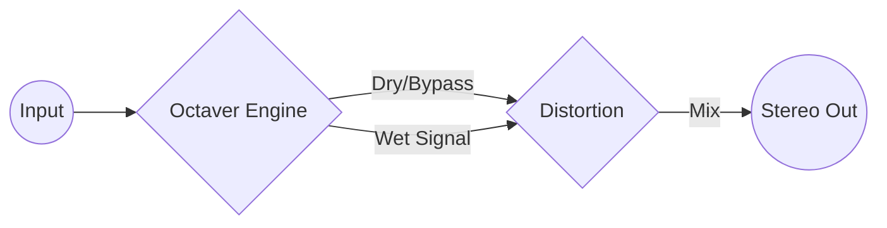

# SuperCollider-Pedalboard
**A programmable live-FX rig built in SuperCollider, featuring custom Octaver, Looper and Distortion engines with smart signal routing for latency-free performance.**

> *Turn your laptop into a modular effects pedalboard. No hardware required, just code.*


## About The Project

This project explores the boundaries of **live audio processing** using code. Instead of relying on expensive hardware pedals or rigid DAW plugins, this script creates a flexible, low-latency effects chain specifically designed for monophonic instruments (like a Trumpet or a Trombone).

The core philosophy is **Playability & Stability**. The rig features a custom routing engine that handles signal flow dynamically—ensuring that bypassing an effect results in a perfectly clean signal without volume drops or phase issues.

### Why SuperCollider?
Using SuperCollider allows for experimental sound design that goes beyond standard VSTs. For example, the **Subharmonic Generator** doesn't just pitch-shift the audio; it tracks the input pitch and synthesizes a new sine wave based on the input envelope, creating a massive, synth-like low end that follows the acoustic instrument.
Also SuperCollider is capable of **realtime changes and responsiveness to my performance** which makes it a good choice as a live realtime effect-rig.

## Key Features

* **Two Octaver Engines:**
    * **PitchShift Mode:** Standard, granular pitch shifting for a natural sound.
    * **Subharmonic Mode:** Tracks pitch and generates a synthetic sub-bass (Sine wave) triggered by the input envelope.
* **Distortion Stage:**
    * Selectable between **Tube Saturation** (`tanh`) and **Wave Folding** (`fold2`) for aggressive timbres.
* **Smart Signal Routing:**
    * Prevents signal doubling when effects are bypassed.
    * Seamlessly switches the "Octaver" synth into a "Through-Cable" mode when inactive.
* **Live GUI & Shortcuts:**
    * Designed to be controlled via keyboard shortcuts during a performance without looking at the screen.
    * "Zombie-Safe" startup routine (cleans the server before booting).

## The Rig Architecture

The signal flow is constructed using `Groups` and `Audio Buses` to ensure proper ordering of effects.


*Note: When the Octaver is toggled OFF, the script dynamically reconfigures the Synth to act as a dry pass-through cable, maintaining unity gain.*

## Getting Started

### Prerequisites
* **SuperCollider:** Download and install from supercollider.github.io.

* **Audio Interface:** An ASIO interface (Windows) or CoreAudio device (Mac). The script is pre-configured for Focusrite USB ASIO.

* **Microphone or line-in:** A microphone or line-in to record your instrument.

* **Speakers:** Speakers for monitoring and playing back your effected signal.

### Installation
1. Clone this repository:

```bash
git clone [https://github.com/YOUR_USERNAME/SC-Live-Octaver.git](https://github.com/YOUR_USERNAME/SC-Live-Octaver.git)
```

2. Open `SuperCollider-Pedalboard.scd` in the SuperCollider IDE.

3. **Important:** Check the Server Setup section at the top of the file and adjust the device name to match your audio interface:

```supercollider
s.options.device = "ASIO : Focusrite USB ASIO"; // Change this!
```

### Usage
1. Select the entire code block (Ctrl+A).

2. Evaluate the code (Ctrl+Enter).

3. A GUI window will appear, and the server will boot.

## Live Controls
The rig is controlled entirely via keyboard shortcuts for fast access:

| Key | Function | Description |
| :--- | :--- | :--- |
| `#` | **Toggle Octaver** | Switches the Octaver ON/OFF (Bypass). |
| `+` | **Switch Mode** | Toggles between PitchShift and Subharmonic engine. |
| `1` | **Octave -1** | Sets the drop to 1 octave down. |
| `2` | **Octave -2** | Sets the drop to 2 octaves down. |
| `3` | **Octave -3** | Sets the drop to 3 octaves down. |
| `D` | **Toggle Dist** | Turns the Distortion stage ON/OFF. |
| `F` | **Dist Type** | Switches distortion flavor (Tube vs. Fold). |

*In the future this will be controlled by a MIDI-pedalboard such as the **Behringer FCB 1010**.*

## Code Highlights

### The "Zombie-Killer" Startup

To ensure stability during live coding sessions, the script includes a robust cleanup routine. It frees all nodes and groups and ensures synchronization before allocating new resources:

```supercollider
~startRig = {
    fork {
        ~stopRig.();
        s.sync; // Wait for server cleanup
        // ... re-allocate buses and synths ...
    };
};
```

### Dynamic Routing Logic
Handling the mix when bypassing effects is critical. The script updates the Synth arguments dynamically to prevent volume spikes (+6dB) that occur when summing dry signals.

## To-Do / Future Ideas

* MIDI implementation (Control via Foot Controller) --> **Behringer FCB 1010**

* Add a Looper-pedal funcionality.

* Add more and heavier distortion capabilities

## License

This project is open-source. Feel free to use it, break it, and make noise with it.